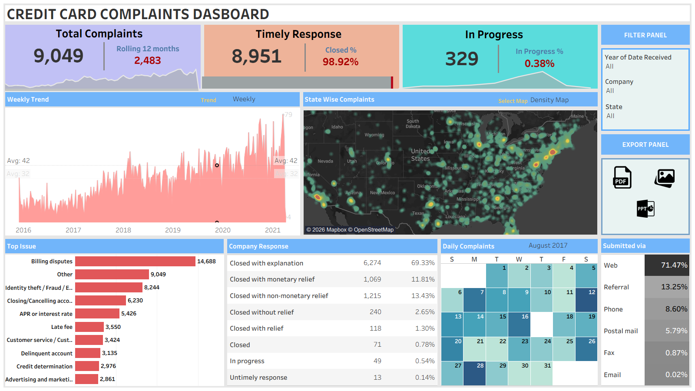

# 💳 Credit Card Complaints Dashboard

An interactive **Credit Card Complaints Dashboard** developed using Tableau to analyze customer complaints, response performance, complaint trends, geographic distribution, complaint issues, and submission channels.

The dashboard provides a comprehensive view of complaint volumes and organizational response performance.

## 📊 Dashboard Preview



## 🎯 Objectives

- Monitor overall credit card complaint volume.
- Analyze complaint response and closure performance.
- Identify major complaint categories.
- Track complaint trends over time.
- Analyze complaints geographically across U.S. states.
- Understand customer complaint submission channels.
- Evaluate company responses to customer complaints.

## 📌 Key KPIs

- **Total Complaints:** 9,049
- **Rolling 12-Month Complaints:** 2,483
- **Timely Responses:** 8,951
- **Closed Complaints:** 98.92%
- **In-Progress Complaints:** 329
- **In-Progress Rate:** 0.38%

## 📈 Key Visualizations

- Weekly Complaint Trend
- State-wise Complaint Density Map
- Top Complaint Issues
- Company Response Analysis
- Daily Complaint Calendar
- Complaint Submission Channels
- Timely Response & Closure KPIs
- Interactive Filters for Year, Company, and State

## 🔍 Key Insights

- The dashboard provides an overview of complaint volume and response performance.
- Complaint trends can be analyzed over time to identify periods of increased activity.
- Geographic visualization highlights areas with higher complaint concentrations.
- Top complaint categories help identify the major issues reported by customers.
- Company response analysis provides visibility into how complaints were resolved.
- Submission channel analysis shows how customers primarily report complaints.

## 🛠️ Tools Used

- Tableau
- Data Visualization
- Geographic Mapping
- Calculated Fields
- Filters
- Parameters
- Interactive Dashboard Design

## 📂 Files

```text
Credit-Card-Complaints-Dashboard/
│
├── README.md
├── Credit_Card_Complaints_Dashboard.twbx
│
└── images/
    └── Credit_Card_Complaints_Dashboard.png
