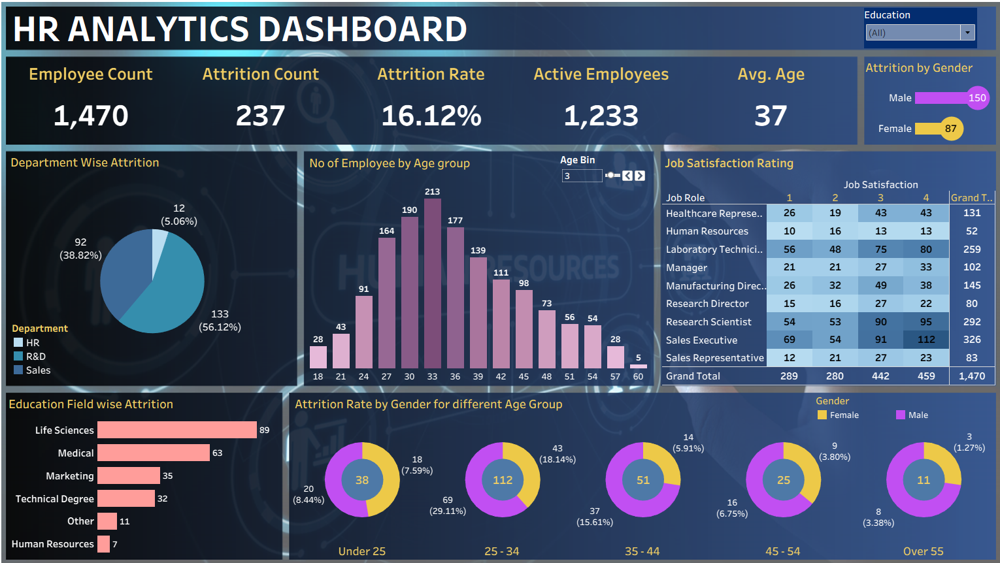

# 👥 HR Analytics Dashboard

An interactive **HR Analytics Dashboard** developed using Tableau to analyze employee workforce, attrition, demographics, job satisfaction, and departmental performance.

The dashboard provides a consolidated view of key HR metrics and helps identify employee attrition patterns across different departments, age groups, genders, education fields, and job roles.

## 📊 Dashboard Preview



## 🎯 Objectives

- Analyze overall employee workforce and attrition.
- Monitor employee attrition rate and active employees.
- Identify attrition patterns across departments and genders.
- Analyze employee distribution by age group.
- Evaluate job satisfaction across different job roles.
- Understand attrition trends across education fields.
- Compare attrition across different age groups and genders.

## 📌 Key KPIs

- **Employee Count:** 1,470
- **Attrition Count:** 237
- **Attrition Rate:** 16.12%
- **Active Employees:** 1,233
- **Average Employee Age:** 37

## 📈 Key Visualizations

- Department-wise Attrition
- Attrition by Gender
- Employee Distribution by Age Group
- Job Satisfaction Rating by Job Role
- Education Field-wise Attrition
- Attrition Rate by Gender and Age Group
- Education Filter
- Interactive Age Bin Parameter

## 🔍 Key Insights

- The dashboard provides a clear overview of overall employee attrition.
- Attrition can be compared across departments and demographic groups.
- Age-group analysis helps identify workforce distribution patterns.
- Job satisfaction can be analyzed across different job roles.
- Education and gender-based analysis provides additional insights into employee attrition.

## 🛠️ Tools Used

- Tableau
- Data Visualization
- Calculated Fields
- Filters
- Parameters
- Interactive Dashboard Design

## 📂 Files

```text
HR-Analytics-Dashboard/
│
├── README.md
├── HR_Analytics_Dashboard.twbx
|
└── screenshots/
    └── HR_Analytics_Dashboard.png
